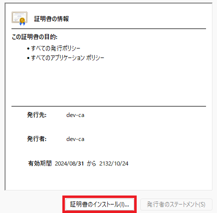
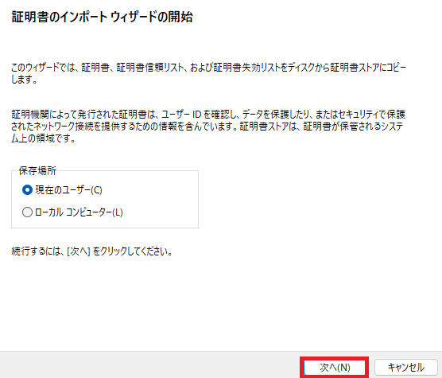
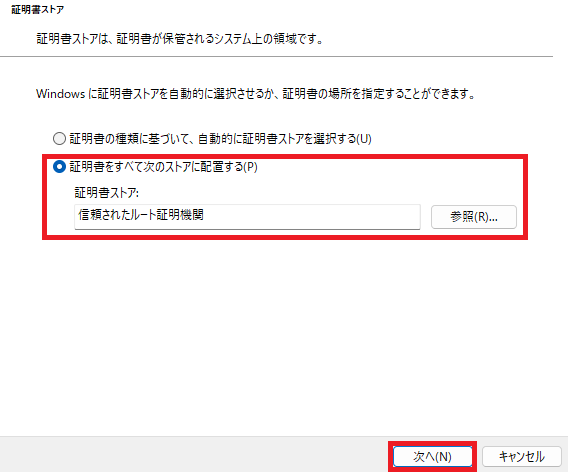
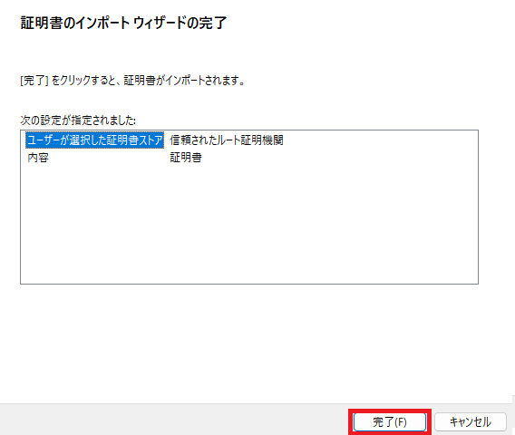

# ユーザーガイド

## CA 証明書のインポート

自己署名CA証明書をインポートしておくことで、`https` 通信時の証明書エラーを回避できます。[colabkit-rca.crt](/assets/colabkit-rca.crt) をダウンロードしてダブルクリックします。

①「証明書のインストール」をクリック。



② デフォルトの「現在のユーザー」のまま次へをクリック。



③ 「証明書をすべてのストアに配置する」を選択して、証明書ストアは「信頼されたルート証明機関」を選択し、次へをクリック。



④ 「完了」をクリック。



## Git for Windows 向け設定

### SSL Backend 変更

Git が Windows 証明書ストアを利用するように設定します。
この設定によってインポートした CA 証明書を参照できるようになります。

```
git config --global http.sslBackend schannel
```

[SSL certificate problem: self-signed certificate in certificate chain error in GIT | Bitbucket Cloud | Atlassian Documentation](https://ja.confluence.atlassian.com/bbkb/ssl-certificate-problem-self-signed-certificate-in-certificate-chain-error-in-git-1224773006.html)

## TourtoiseGit 向け設定

### SSH Client 変更

TourtoiseGit のデフォルトの SSH Client は Putty（plink）ですが、PuTTY 形式の鍵を扱う必要があり、GitLab との連携がしづらいため、OpenSSH を利用するように設定します。

Network > SSH Clinet:
```
C:\Windows\System32\OpenSSH\ssh.exe
```
